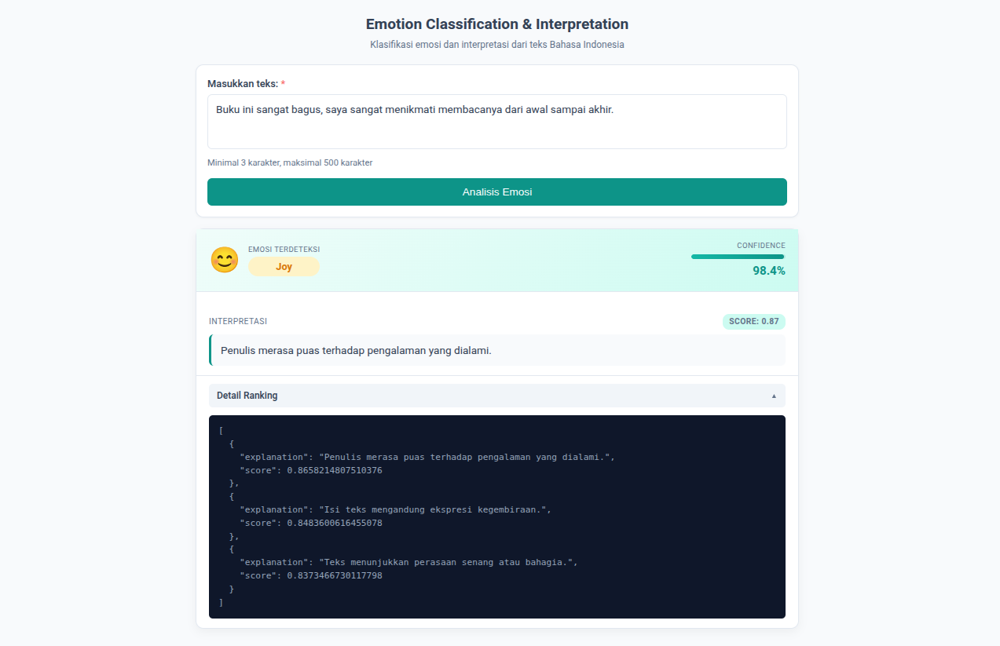

# Emotion Classification & Interpretation

Sistem klasifikasi emosi berbasis NLP untuk teks Bahasa Indonesia. Menggunakan model DistilBERT yang sudah di-fine-tune untuk mengklasifikasikan 6 emosi (anger, disgust, fear, joy, sadness, surprise) dan memberikan interpretasi menggunakan semantic similarity.



## Problem Statement

Model klasifikasi emosi modern sudah mampu menghasilkan klasifikasi emosi yang akurat melalui proses pemahaman konteks yang kompleks. Namun, output yang dihasilkan hanya berupa label emosi dan confidence score tanpa penjelasan yang dapat dipahami manusia.

Sebagai contoh, ketika model mengklasifikasikan teks sebagai "joy" dengan confidence tinggi, pengguna tidak tahu aspek apa dari teks yang menunjukkan emosi tersebut atau mengapa model memilih label tersebut. Tanpa penjelasan yang jelas, sulit untuk memahami konteks emosi dan mengambil tindakan yang tepat.

Proyek ini menambahkan layer interpretasi yang bekerja setelah klasifikasi emosi selesai. Setelah model menghasilkan label emosi yang final, sistem membandingkan teks input dengan kandidat penjelasan untuk label tersebut menggunakan semantic similarity. Dengan pendekatan ini, setiap prediksi dilengkapi dengan penjelasan natural language yang menjelaskan hasil klasifikasi dalam bahasa yang dapat dipahami manusia.

## Features

- Klasifikasi emosi 6 kelas dari teks Bahasa Indonesia (anger, disgust, fear, joy, sadness, surprise)
- Interpretasi semantik yang memilih penjelasan terbaik dari kandidat berdasarkan similarity score
- RESTful API untuk integrasi dengan sistem lain
- Detail ranking yang menampilkan semua kandidat penjelasan dengan score

## Limitations

- Hanya mendukung bahasa Indonesia
- Akurasi model tidak 100% (seperti semua model machine learning)
- Tidak dapat memahami sarkasme atau konteks yang sangat ambigu
- Interpretasi hanya muncul jika confidence score >= 0.60 (dapat diubah via environment variable)
- Embedding model diakses via HuggingFace Inference API, sehingga membutuhkan koneksi internet saat runtime
- Model emotion classifier berukuran ~250MB, download pertama kali membutuhkan waktu

## Models Lifecycle

Model tidak di-commit ke Git karena ukurannya yang besar.

**Cara kerja:**
1. Model emotion classifier (`qrizan/emotion-classifier-indonesia`) tersedia di HuggingFace Hub
2. Saat Docker build, model di-download menggunakan script `scripts/download_model.py`
3. Model tersimpan di Docker image layer, sehingga saat container start tidak perlu download lagi
4. Embedding model (`intfloat/multilingual-e5-small`) dipanggil via HuggingFace Inference API dan tidak di-download ke lokal

**Catatan:**
- Build pertama kali membutuhkan waktu ~5-20 menit ( tergantung koneksi internet ) karena proses download model
- Build berikutnya lebih cepat karena Docker menggunakan layer cache
- Startup container cepat (~5 detik) karena model sudah tersedia di image
- Embedding model selalu diakses via API, sehingga membutuhkan koneksi internet saat runtime

## Quick Start

### Docker (Recommended)

```bash
# 1. Copy .env.example (opsional, untuk override konfigurasi)
cp .env.example .env

# 2. Edit .env jika perlu (misalnya set HF_TOKEN untuk download lebih cepat)

# 3. Build dan jalankan
docker-compose up --build

# 4. Tunggu build selesai (pertama kali ~5-10 menit)
# 5. Buka http://localhost:8000
```

### Manual Setup

```bash
# 1. Buat virtual environment
python3 -m venv emotion-env
source emotion-env/bin/activate  # Linux/Mac
# atau
emotion-env\Scripts\activate     # Windows

# 2. Install dependencies
pip install -r requirements.txt

# 3. Set environment variables (opsional)
export MODEL_PATH="qrizan/emotion-classifier-indonesia"
export HF_TOKEN="your_token"  # opsional, untuk download lebih cepat

# 4. Jalankan server
uvicorn app.main:app --reload
```

## Usage

### Web Interface

Buka `http://localhost:8000` di browser. Masukkan teks Bahasa Indonesia dan klik tombol "Analisis Emosi". Hasil akan muncul di bawah form tanpa reload halaman. Setelah analisis selesai, form input akan otomatis collapse untuk menghemat ruang layar. Klik tombol "Edit" untuk menganalisis teks baru.

### API

```bash
curl -X POST "http://localhost:8000/api/predict" \
  -H "Content-Type: application/json" \
  -d '{"text": "Saya sangat senang hari ini!"}'
```

**Response:**
```json
{
  "label": "joy",
  "confidence": 0.9976,
  "interpretation": "Teks menunjukkan perasaan senang atau bahagia.",
  "similarity_score": 0.8323,
  "ranking": [
    {
      "explanation": "Teks menunjukkan perasaan senang atau bahagia.",
      "score": 0.8323
    },
    {
      "explanation": "Penulis merasa puas terhadap pengalaman yang dialami.",
      "score": 0.8229
    }
  ]
}
```

## Project Structure

```
emotion-classification-interpretation/
├── app/
│   ├── main.py              # FastAPI application
│   ├── core/                # Core logic (model, interpretation, config)
│   ├── services/            # External services (HuggingFace API client)
│   ├── templates/           # HTML templates (Jinja2)
│   └── static/              # CSS styling
├── scripts/
│   └── download_model.py    # Script untuk download model saat build
├── notebooks/               # Training notebooks
├── screenshots/             # Screenshot aplikasi
├── Dockerfile
├── docker-compose.yml
└── requirements.txt
```

## Technologies

- [FastAPI](https://fastapi.tiangolo.com/) - Web framework untuk API
- [Transformers](https://huggingface.co/docs/transformers) (HuggingFace) - Library untuk NLP models
- [HTMX](https://htmx.org/) - Library untuk dynamic HTML tanpa JavaScript kompleks
- [Jinja2](https://jinja.palletsprojects.com/) - Template engine untuk HTML
- [Docker](https://www.docker.com/) - Containerization platform

**Models:**
- [qrizan/emotion-classifier-indonesia](https://huggingface.co/qrizan/emotion-classifier-indonesia) - DistilBERT yang sudah di-fine-tune untuk emotion classification
- [intfloat/multilingual-e5-small](https://huggingface.co/intfloat/multilingual-e5-small) - Embedding model untuk semantic similarity (diakses via API)
- [Indonesian DistilBERT Base Model (uncased)](https://huggingface.co/cahya/distilbert-base-indonesian) - Base model yang digunakan untuk fine-tuning

## Resources

#### Documentation
- [MODELING.md](MODELING.md) - Dokumentasi proses modeling (dataset preparation, training, interpretation pipeline)

#### Dataset
- [EmoTweetID Dataset](https://data.mendeley.com/datasets/jzgnjsff9f/5) - Dataset yang digunakan untuk training model

#### Training Notebooks (Google Colab)
- [00_setup_environment.ipynb](https://colab.research.google.com/drive/1JYr4cG54Hpbc4fU_-VmCEifnIuG_xThD) - Setup environment dan dependencies
- [01_dataset_preparation.ipynb](https://colab.research.google.com/drive/1utV-2a2ya5E4gPnZVhags7De-bxCgY45) - Persiapan dan preprocessing dataset
- [02_train_emotion_classifier.ipynb](https://colab.research.google.com/drive/14qHwE-mtN9-BKQT-bcr3gEUhsyuXxvZH) - Training model emotion classifier
- [03_interpretation_pipeline.ipynb](https://colab.research.google.com/drive/1PSBCRjKbnKI2BdiBedoy3CzhohthgvBN) - Implementasi pipeline interpretasi

## Environment Variables

Semua konfigurasi default ada di `app/core/config.py` dan dapat di-override via environment variables:

- `MODEL_PATH`: Model path atau HuggingFace model ID (default: `qrizan/emotion-classifier-indonesia`)
- `CONFIDENCE_THRESHOLD`: Threshold untuk menampilkan interpretasi (default: `0.60`)
- `EMBEDDING_MODEL_NAME`: Nama embedding model (default: `intfloat/multilingual-e5-small`)
- `MAX_LENGTH`: Maximum token length untuk tokenization (default: `128`)
- `HF_TOKEN`: HuggingFace API token (opsional, untuk download lebih cepat dan rate limit lebih baik)
- `HUGGINGFACE_API_KEY`: Alias untuk `HF_TOKEN` (opsional)

Lihat `.env.example` untuk detail lengkap.

## Notes

- Proyek ini dibuat untuk **catatan pembelajaran NLP**, bukan untuk production use
- Model dilatih dengan dataset yang terbatas
- Kode dibuat sederhana agar mudah dipahami dan dimodifikasi
- Model di-download saat Docker build time, bukan saat startup, untuk memastikan startup yang cepat
- Embedding model diakses via API karena lebih praktis daripada download model besar lagi ke lokal
